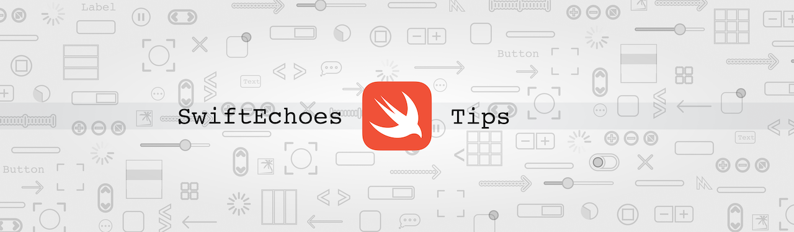

<p align="center">
    
</p>

# 🔥 Swift tips and tricks

Here's list of Swift tips & tricks with all additional sources (playgrounds, images) that I would like to share. Also you can find them on [Twitter @szubyak](https://twitter.com/szubyak), where you can ask questions and respond with feedback. I will really glad to have you there! 😀

## 📃 Table of contents

[#61 `XCTUnwrap` assertion function]()<br />
[#60 `UITableViewCell` identifier]()<br />
[#59 `AlertPresentable` protocol](https://github.com/Luur/SwiftTips#59-alertpresentable-protocol)<br />
[#58 CollectionView extension for adaptive grid layout](https://github.com/Luur/SwiftTips#58-collectionview-extension-for-adaptive-grid-layout)<br />
[#57 Render HTML within a `UILabel`](https://github.com/Luur/SwiftTips#57-render-html-within-a-uilabel)<br />
[#56 Custom `Error` by adopting `LocalizedError` protocol](https://github.com/Luur/SwiftTips#56-custom-error-by-adopting-localizederror-protocol)<br />
[#55 'Result' type without value to provide](https://github.com/Luur/SwiftTips#55-result-type-without-value-to-provide)<br />
[#54 Given, When, Then](https://github.com/Luur/SwiftTips#54-given-when-then)<br />
[#53 `sut` and test lifecycle](https://github.com/Luur/SwiftTips#53-sut-and-test-lifecycle)<br />
[#52 Point on circle perimeter](https://github.com/Luur/SwiftTips#52-point-on-circle-perimeter)<br />
[#51 `zip()` function](https://github.com/Luur/SwiftTips#51-zip-function)<br />
[#50 StackView custom spacing](https://github.com/Luur/SwiftTips#50-stackview-custom-spacing)<br />
[#49 Named UIColor](https://github.com/Luur/SwiftTips#49-named-uicolor)<br />
[#48 `Result` error handling](https://github.com/Luur/SwiftTips#48-result-error-handling)<br />
[#47 Generics: Type parameters](https://github.com/Luur/SwiftTips#47-generics-type-parameters)<br />
[#46 Generics: Basics](https://github.com/Luur/SwiftTips#46-generics-basics)<br />
[#45 UserDefaults during testing](https://github.com/Luur/SwiftTips#45-userdefaults-during-testing)<br />
[#44 Additional Info to #38 Protocols: Optional methods](https://github.com/Luur/SwiftTips#44-additional-info-to-38-protocols-optional-methods)<br />
[#43 Responsible view controller for particular view](https://github.com/Luur/SwiftTips#43-responsible-view-controller-for-particular-view)<br />
[#42 Move between textfields](https://github.com/Luur/SwiftTips#42-move-between-textfields)<br />
[#41 Autogenerated `allCases` property for your `enum` (Swift 4.2)](https://github.com/Luur/SwiftTips#41-autogenerated-allcases-property-for-your-enum-swift-42)<br />
[#40 Protocols: Class-only](https://github.com/Luur/SwiftTips#40-protocols-class-only)<br />
[#39 Protocols: Inheritance and composition](https://github.com/Luur/SwiftTips#39-protocols-inheritance-and-composition)<br />
[#38 Protocols: Optional methods](https://github.com/Luur/SwiftTips#38-protocols-optional-methods)<br />
[#37 Protocols: Naming](https://github.com/Luur/SwiftTips#37-protocols-naming)<br />
[#36 Property observers, getter/setter and lazy are mutually exclusive](https://github.com/Luur/SwiftTips#36-property-observers-gettersetter-and-lazy-are-mutually-exclusive)<br />
[#35 Prepare Alamofire standalone functions to unit-testing](https://github.com/Luur/SwiftTips#35-prepare-alamofire-standalone-functions-to-unit-testing)<br />
[#34 Sort array of objects with multiple optional criteria](https://github.com/Luur/SwiftTips#34-sort-array-of-objects-with-multiple-optional-criteria)<br /> 
[#33 Remove object from array](https://github.com/Luur/SwiftTips#33-remove-object-from-array)<br /> 
[#32 Delegate naming](https://github.com/Luur/SwiftTips#32-delegate-naming)<br /> 
[#31 Run, Playground, run!](https://github.com/Luur/SwiftTips#31-run-playground-run)<br /> 
[#30 `DispatchGroup` usage](https://github.com/Luur/SwiftTips#30-dispatchgroup-usage)<br />
[#29 Remove duplicates](https://github.com/Luur/SwiftTips#29-remove-duplicates)<br />
[#28 Debugging: View Debugging](https://github.com/Luur/SwiftTips#28-debugging-view-debugging)<br />
[#27 Debugging: Breakpoints](https://github.com/Luur/SwiftTips#27-debugging-breakpoints)<br />
[#26 Debugging: Asserts](https://github.com/Luur/SwiftTips#26-debugging-asserts)<br />
[#25 Debugging: Log functions](https://github.com/Luur/SwiftTips#25-debugging-log-functions)<br />
[#24 Update `UIView` content with animation](https://github.com/Luur/SwiftTips#24-update-uiview-content-with-animation)<br />
[#23 Observe MOC changes](https://github.com/Luur/SwiftTips#23-observe-moc-changes)<br />
[#22 Split `String` into words](https://github.com/Luur/SwiftTips#22-split-string-into-words)<br />
[#21 Comparing tuples](https://github.com/Luur/SwiftTips#21-comparing-tuples)<br />
[#20 How to detect that user stop typing](https://github.com/Luur/SwiftTips#20-how-to-detect-that-user-stop-typing)<br />
[#19 Left/rigth text offset inside `UITextField`](https://github.com/Luur/SwiftTips#19-leftrigth-text-offset-inside-uitextfield)<br />
[#18 Common elements in two arrays](https://github.com/Luur/SwiftTips#18-common-elements-in-two-arrays)<br />
[#17 Apply gradient to Navigation Bar](https://github.com/Luur/SwiftTips#17-apply-gradient-to-navigation-bar)<br />
[#16 Get next element of array](https://github.com/Luur/SwiftTips#16-get-next-element-of-array)<br />
[#15 Split array by chunks of given size](https://github.com/Luur/SwiftTips#15-split-array-by-chunks-of-given-size)<br />
[#14 Transparent/Opaque Navigation Bar](https://github.com/Luur/SwiftTips#14-transparentopaque-navigation-bar)<br />
[#13 Group objects by property](https://github.com/Luur/SwiftTips#13-group-objects-by-property)<br />
[#12 Semicolons in Swift](https://github.com/Luur/SwiftTips#12-semicolons-in-swift)<br />
[#11 Fake AppDelegate](https://github.com/Luur/SwiftTips#11-fake-appdelegate)<br />
[#10 Invoke `didSet` when property’s value is set inside `init` context](https://github.com/Luur/SwiftTips#10-invoke-didset-when-propertys-value-is-set-inside-init-context)<br />
[#9 Change type of items in array](https://github.com/Luur/SwiftTips#9-change-type-of-items-in-array)<br />
[#8 `forEach` and `map` execution order difference](https://github.com/Luur/SwiftTips#8-foreach-and-map-execution-order-difference)<br />
[#7 Testing settings](https://github.com/Luur/SwiftTips#7-testing-settings)<br />
[#6 Tips for writing error messages](https://github.com/Luur/SwiftTips#6-tips-for-writing-error-messages)<br />
[#5 Profit to compiler](https://github.com/Luur/SwiftTips#5-profit-to-compiler)<br />
[#4 Combinations of pure functions](https://github.com/Luur/SwiftTips#4-combinations-of-pure-functions)<br />
[#3 Enumerated iteration](https://github.com/Luur/SwiftTips#3-enumerated-iteration)<br />
[#2 Easy way to hide Status Bar](https://github.com/Luur/SwiftTips#2-easy-way-to-hide-status-bar)<br />
[#1 Safe way to return element at specified index](https://github.com/Luur/SwiftTips#1-safe-way-to-return-element-at-specified-index)<br />

## [#61 `XCTUnwrap` assertion function]()

In Xcode 11 new assertion function added for use in Swift tests. `XCTUnwrap` asserts that an Optional variable’s value is not `nil`, returning the unwrapped value of expression for subsequent use in the test. It protects you from dealing with conditional chaining for the rest of the test. Also it removes the need to use `XCTAssertNotNil(_:_:file:line:)` with either unwrapping the value. It’s common to unwrap optional before checking it for a particular value so that’s really where `XCTUnwrap()` will come into its own.

```swift

struct Note {
    var id: Int
    var title: String
    var body: String
}

class NotesViewModel {

    static func all() -> [Note] {
        return [
            Note(id: 0, title: "first_note_title", body: "first_note_body"),
            Note(id: 1, title: "second_note_title", body: "second_note_body"),
        ]
    }
}


func testGetFirstNote() throws {
    let notes = NotesViewModel.all()
    let firstNote =  try XCTUnwrap(notes.first)
    XCTAssertEqual(firstNote.title, "first_note_title")
}
```

This approach is cleaner than what we might have written previously:

```swift
func testGetFirstNote() {
    let notes = NotesViewModel.all()
    if let firstNote = notes.first {
        XCTAssertEqual(firstNote.title, "first_note_title")
    } else {
        XCTFail("Failed to get first note.")
    }
}
```

Back to [Top](https://github.com/Luur/SwiftTips#-table-of-contents) 

## [#60 `UITableViewCell` identifier]()

 To register or dequeue `UITableViewCell` object we need to provide its string type `identifier`.  Typing string by hand is wasting time and could couse you typos. In this case I would recomend to use extension which declares static `identifier` property inside `UITableViewCell` to avoid these problems.
 
 ```swift
 extension UITableViewCell {
    static var identifier: String {
        return String(describing: self)
    }
 }
 
 let cell = tableView.dequeueReusableCell(withIdentifier: ExampleTableViewCell.identifier)
 tableView.register(ExampleTableViewCell.self, forCellReuseIdentifier: ExampleTableViewCell.identifier)
 
 print(ExampleTableViewCell.identifier) //ExampleTableViewCell
 ```
 
 Back to [Top](https://github.com/Luur/SwiftTips#-table-of-contents) 

## [#59 `AlertPresentable` protocol](https://twitter.com/szubyak/status/1176760937505837056)

In my current project I work on I present alerts almost on every view controller. To reduce lines of codes and time spent on duplicate code I created `AlertPresentable` layer and want to share it with you.
Any `ViewController` which implements `AlertPresentable` protocol receive opportunity to present any type of alerts discribed in this layer just by one line of code.

```swift
protocol AlertPresentable {
    func presentErrorAlert(with message: String)
    func presentSuccessAlert(with message: String, action: ((UIAlertAction) -> Void)?)
    func presentConfirmationAlert(with message: String, action: ((UIAlertAction) -> Void)?)
}

extension AlertPresentable where Self: UIViewController {

    func presentErrorAlert(with message: String) {
        presentAlert(message: message, actions: [UIAlertAction(title: "OK", style: .cancel, handler: nil)])
        }

    func presentSuccessAlert(with message: String, action: ((UIAlertAction) -> Void)?) {
        presentAlert(message: message, actions: [UIAlertAction(title: "OK", style: .cancel, handler: action)])
    }

    func presentConfirmationAlert(with message: String, action: ((UIAlertAction) -> Void)?) {
        presentAlert(message: message, actions: [UIAlertAction(title: "Yes", style: .default, handler: action), UIAlertAction(title: "No", style: .cancel, handler: nil)])
    }

    private func presentAlert(title: String? = "", message: String? = nil, actions: [UIAlertAction] = []) {
        let alertController = UIAlertController(title: title, message: message, preferredStyle: .alert)
        actions.forEach { (action) in
            alertController.addAction(action)
        }
        present(alertController, animated: true, completion: nil)
    }
}
```

Usage:

```swift
class ViewController: UIViewController, AlertPresentable {

    override func viewDidLoad() {
        super.viewDidLoad()

        presentErrorAlert(with: "User not found")

        presentSuccessAlert(with: "File downloaded") { _ in
            // use downloaded file
        }

        presentConfirmationAlert(with: "Are you sure you would like to sign out?") { _ in
            // sign out user
        }
    }
}
```

Back to [Top](https://github.com/Luur/SwiftTips#-table-of-contents) 

## [#58 CollectionView extension for adaptive grid layout](https://twitter.com/szubyak/status/1171870893817180161)

Implementation of grid CollectionView layout is a commont task. But I found that calculation of cell width when you dont know how many cells can fit in one row of CollectionView is not a common task.

Here is my extension for calculation width of cell in grid CollectionView to make your layot adaptive.

```swift
extension UICollectionView {

    func flexibleCellWidth(minCellWidth: CGFloat, minimumInteritemSpacing: CGFloat) -> CGFloat {
        let contentWidth = frame.size.width - contentInset.left - contentInset.right
        let numberOfItemsInRow = Int((contentWidth + minimumInteritemSpacing) / (minCellWidth + minimumInteritemSpacing))
        let spacesWidth = CGFloat(numberOfItemsInRow - 1) * minimumInteritemSpacing
        let availableContentWidth = contentWidth - spacesWidth
        return availableContentWidth / CGFloat(numberOfItemsInRow)
    }
}
```

Based on minimal cell width and minimal interitem spacing it autocalculates number of cells in row and return cell width for the best placement.

```swift
func collectionView(_ collectionView: UICollectionView, layout collectionViewLayout: UICollectionViewLayout, sizeForItemAt indexPath: IndexPath) -> CGSize {
    let cellWidth = collectionView.flexibleCellWidth(minCellWidth: 72, minimumInteritemSpacing: 10)
    return CGSize(width: cellWidth, height: cellWidth)
}
```

iPhoneSE   

iPhoneX     

Back to [Top](https://github.com/Luur/SwiftTips#-table-of-contents) 

## [#57 Render HTML within a `UILabel`](https://twitter.com/szubyak/status/1171788553665355776)

You can render HTML strings within a `UILabel` using a special initializer of `NSAttributedString` and passing in `NSAttributedString.DocumentType.html` for `.documentType`. But in most cases it is not enough to display it as is. If we want to add custom font or color we need to use CSS (add CSS header to our HTML string).

```swift
extension String {

    func htmlAttributedString(with fontName: String, fontSize: Int, colorHex: String) -> NSAttributedString? {
        do {
            let cssPrefix = "<style>* { font-family: \(fontName); color: #\(colorHex); font-size: \(fontSize); }</style>"
            let html = cssPrefix + self
            guard let data = html.data(using: String.Encoding.utf8) else {  return nil }
            return try NSAttributedString(data: data, options: [.documentType: NSAttributedString.DocumentType.html, .characterEncoding: String.Encoding.utf8.rawValue], documentAttributes: nil)
        } catch {
            return nil
        }
    }
}
```

Usage [example](https://github.com/Luur/SwiftTips/blob/master/Sources/57/example.playground/Contents.swift)

Back to [Top](https://github.com/Luur/SwiftTips#-table-of-contents) 

## [#56 Custom `Error` by adopting `LocalizedError` protocol](https://twitter.com/szubyak/status/1074629447364567040)

Custom errors are an integral parts of you work. Swift-defined error types can provide localized error descriptions by adopting the new `LocalizedError` protocol. 

```swift
enum UserError: Error {
    case credentialsNotMatch
    case invalidEmail
    case invalidName
}

extension UserError: LocalizedError {
    public var errorDescription: String? {
        switch self {
            case .credentialsNotMatch:
                return NSLocalizedString("Your username and/or password do not match", comment: "Credentials do not match")
            case .invalidEmail:
                return NSLocalizedString("Please enter email address in format: yourname@example.com", comment: "Invalid email format")
            case .invalidName:
                return NSLocalizedString("Please enter you name", comment: "Name field is blank")
        }
    }
}
```

Example:

```swift
func validate(email: String?, password: String?) throws {
    throw UserError.credentialsNotMatch
}

do {
    try validate(email: "email", password: "password")
} catch UserError.credentialsNotMatch {
    print(UserError.credentialsNotMatch.localizedDescription)
}
```

You can provide even more information. It's common decency to show user except error description also failure reasons and recovery suggestions. Sorry for ambiguous error messages :)

```swift
enum ProfileError: Error {
    case invalidSettings
}

extension ProfileError: LocalizedError {
    public var errorDescription: String? {
        switch self {
            case .invalidSettings:
                return NSLocalizedString("Your profile settings are incorrect", comment: "")
        }
    }

    public var failureReason: String? {
        switch self {
            case .invalidSettings:
                return NSLocalizedString("I don't know why", comment: "")
        }
    }
    
    public var recoverySuggestion: String? {
        switch self {
            case .invalidSettings:
                return NSLocalizedString("Please provide correct profile settings", comment: "")
        }
    }
}

let error = ProfileError.invalidSettings
print(error.errorDescription)
print(error.failureReason)
print(error.recoverySuggestion)
```

Back to [Top](https://github.com/Luur/SwiftTips#-table-of-contents) 

## [#55 `Result` type without value to provide](https://twitter.com/szubyak/status/1073212384418906112)

`Result` type usage is really popular nowadays.

```swift
enum Result<T> {
    case success(result: T)
    case failure(error: Error)
}

func login(with credentials: Credentials, handler: @escaping (_ result: Result<User>) -> Void) {
    // Two possible options:
    handler(Result.success(result: user))
    handler(Result.failure(error: UserError.notFound))
}
```

`login(with:)` operation has `user` value to provide and default `Result` type fits perfectly here. But let’s imagine that your operation hasn’t got value to provide or you don’t care about it. Default `Result` type makes you to provide the result value any way.


To fix this inconvenience you need to add extension and instantiate a generic with an associated value of type `Void`.

```swift
func login(with credentials: Credentials, handler: @escaping (_ result: Result<Void>) -> Void)

extension Result where T == Void {
    static var success: Result {
        return .success(result: ())
    }
}
```

Now we can change our `func login(with:)` a bit, to ignore result success value if we don’t care about it.

```swift
func login(with credentials: Credentials, handler: @escaping (_ result: Result<Void>) -> Void) {
    // Two possible options:
    handler(Result.success)
    handler(Result.failure(error: UserError.notFound))
}
```

Back to [Top](https://github.com/Luur/SwiftTips#-table-of-contents) 

## [#54 Given, When, Then](https://twitter.com/szubyak/status/1052886769375596545)

In unit testing terms, there are three phases to a unit test:

* **Given** prepares the **preconditions** for the test. These preconditions include arguments to the function call, states of the subject, and any test doubles that are used to inspect the test subject in subsequent assertions.
* The **When** phase can be as simple as making the call to the function on the test subject. In the **when** section an operation to be tested is performed.
* The **Then** phase verifies the actual results against your expected results. These are done with **assertions** statements. An assertion can check if something is true or false, nil or non-nil, two objects match or not.

```swift
func testSum() {
    // Given
    let firstValue = 4
    let secondValue = 3
    // When
    let sum = sut.sum(firstValue: firstValue, secondValue: secondValue)
    // Then
    XCTAssertEqual(sum, 7)
}
```

Note: When comparing two values using `XCTAssertEqual` you should always put the actual value first before the expected value.

Back to [Top](https://github.com/Luur/SwiftTips#-table-of-contents) 

## [#53 `sut` and test lifecycle](https://twitter.com/szubyak/status/1039464769403670529)

The **subject under test** is always named `sut` . It refers to a subject that is being tested for correct operation. It is short for "whatever thing we are testing" and is always defined from the perspective of the test.  So when you look at your tests, there is no ambiguity as to what is being tested. All other objects are named after their types. Clearly identifying the subject under test in the `sut` variable makes it stand out from the rest.

The **test lifecycle** for each test is surrounded by a pair of functions - `setUp()` and `tearDown()`. The `setUp()` function is called before the execution of each test function in the test class. The `tearDown()` function is called after the execution of each test function in the test class. They provide you a place to prepare the `sut` ready before the test starts, and clean up the `sut` and any states after the test finishes. It’s important that each test starts with the desired initial state.

```swift
import XCTest

class YourClassTests: XCTestCase {

    // MARK: - Subject under test
    
    var sut: YourClass!
    
    // MARK: - Test lifecycle
    
    override func setUp() {
        super.setUp()
        sut = YourClass()
    }
    
    override func tearDown() {
        sut = nil
        super.tearDown()
    }
}
```

Back to [Top](https://github.com/Luur/SwiftTips#-table-of-contents) 

## [#52 Point on circle perimeter](https://twitter.com/szubyak/status/1034785953200726023)

Could be useful solution for positioning nodes in your game or views in ordinary business application on the perimeter of circle.

```swift
func pointOnCircle(radius: Float, center: CGPoint) -> CGPoint {
    // Random angle between 0 and 2*pi
    let theta = Float(arc4random_uniform(UInt32.max)) / Float(UInt32.max-1) * .pi * 2.0
    // Convert polar to cartesian
    let x = radius * cos(theta)
    let y = radius * sin(theta)
    return CGPoint(x: CGFloat(x) + center.x, y: CGFloat(y) + center.y)
}
```

Back to [Top](https://github.com/Luur/SwiftTips#-table-of-contents) 

## [#51 `zip()` function](https://twitter.com/szubyak/status/1032565476143050753)

Let’s imagine you have an array of LOTR heroes, and an array of weapons that match those heros. How could I create a list with the heros and weapons combined at each index? `zip()` function is designed to combine two sequences into a single sequence of tuples. 


Note: I would recomend to wrap the output from `zip()` into array to make its output easier to read.

One of the useful features of `zip()` is that if your two arrays arent equal in size it will choose the shorter one. Yes, it will not crash your application, just ignore element which doesn’t have a match in second sequence.

Back to [Top](https://github.com/Luur/SwiftTips#-table-of-contents) 

## [#50 `StackView` custom spacing](https://twitter.com/szubyak/status/1031853568586854400)

`StackView`, introduced in iOS 9, made Auto Layout usage much easier, because of reducing the amount of constraints needed to create manually for common layouts. But we faced with the problem, property `spacing` applies equally to the arranged subviews of `StackView`. Before iOS 11, there were 2 ways how to overcome this problem.
One way is to create views with desired height and use them as spacer views or we could do it by nesting stack views but these two ways always seemed to be an unnecessary complication.

 In iOS 11 you can create stack views with custom spacing between views. But there is no way to specify this custom spacing in Storyboard, only in code.
 
 ```swift
stackView.setCustomSpacing(32.0, after: label)
```

Also, in iOS 11 Apple introduced default and system spacing properties on the `UIStackView` class. You can use these to set or reset the custom spacing after a view.

```swift
stackview.setCustomSpacing(UIStackView.spacingUseSystem, after: label)
```

Back to [Top](https://github.com/Luur/SwiftTips#-table-of-contents) 

## [#49 Named UIColor](https://twitter.com/szubyak/status/1031489173440684032)

XCode 9.0 gives us opportunity to create named colors. We can do it directly inside assets catalog and use it in code and storyboards. Named colors contain 3 parts: name ("FerrariRed"), color specified as range and device compatibility.


Created named color you can use like this:

```swift
view.backgroundColor = UIColor(named: "FerrariRed")
```

Inside storyboards you can use created named color by selecting it from the color dropdown menu.

Back to [Top](https://github.com/Luur/SwiftTips#-table-of-contents) 

## [#48 `Result` error handling]()

Error handling is realy common functionality. But if you want to handle errors across asynchronous boundaries or store value/error results for later processing, then ordinary Swift error handling won’t help. The best alternative is a common pattern called a `Result` type: it stores a value/error “sum” type (either one or the other) and can be used between any two arbitrary execution contexts.

Example of `Result` type:

```swift
enum Result<T> {
    case success(result: T)
    case failure(error: String)
}
```

Usage of `Result` type:

```swift
protocol TaskStoreProtocol {
    func fetchTasks(handler: @escaping TaskStoreFetchTasksResult)
}

typealias TaskStoreFetchTasksResult = (_ result: Result<[Task]>) -> Void

class TasksStore: TasksStoreProtocol {
    
    func fetchTasks(handler: @escaping TaskStoreFetchTasksResult) {
        // Some useful code, network request or something like this goes here
        if success {
            handler(Result.success(result: fetchedTasks))
        } else {
            handler(Result.failure(error: error))
        }
    }
}
```

Back to [Top](https://github.com/Luur/SwiftTips#-table-of-contents) 

## [#47 Generics: Type parameters]()

Here I want to introduce you with general info about generic type parameters and their naming style. Type parameters specify and name a placeholder type, and are written immediately after the function’s name, between a pair of angle brackets (such as `<T>`). Once you specify a type parameter, you can use it to define the type of a function’s parameters, or as the function’s return type, or as a type annotation within the body of the function. In each case, the type parameter is replaced with an actual type whenever the function is called.

You can provide more than one type parameter by writing multiple names within the angle brackets, separated by commas.

In most cases, type parameters have descriptive names, such as `Key` and `Value` in `Dictionary<Key, Value>` and `Element` in `Array<Element>`, which tells about the relationship between the type parameter and the generic type or function it’s used in. However, when there isn’t a meaningful relationship between them, it’s traditional to name them using single letters such as `T`, `U`, and `V`.

Back to [Top](https://github.com/Luur/SwiftTips#-table-of-contents) 

## [#46 Generics: Basics]()

You can find usage of generics in several of my tips. So here I want to show you some basics of generics. They are one of the most powerful features of Swift. It gives you opportinity to write flexible, reusable functions. Types that can work with any type, subject to requirements that you define. You can write code that avoids duplication and expresses its intent in a clear, abstracted way.

At first, here is nongeneric function which swaps two `Int` values:
```swift
func swapTwoInts(_ a: inout Int, _ b: inout Int) {
    let temporaryA = a
    a = b
    b = temporaryA
}
```
As you can see, this func is useful but a bit limited, because you can swap only `Int` values. If you want to swap two `String` values, or two `Double` values, you have to write more functions.

Generic functions can work with any type. Here’s a generic representation of our function.
```swift
func swapTwoValues<T>(_ a: inout T, _ b: inout T) {
    let temporaryA = a
    a = b
    b = temporaryA
}
```
The body of our two functions is the same. But the first line of is slightly different. The generic version of the function uses a placeholder type name (called `T`) instead of an actual type name (such as `Int`, `String`, or `Double`). The placeholder type name doesn’t say anything about what `T` must be, but it does say that both `a` and `b` must be of the same type `T`. The actual type to use in place of `T` is determined each time the function is called.

Back to [Top](https://github.com/Luur/SwiftTips#-table-of-contents) 

## [#45 UserDefaults during testing]()

As with all dependencies, we should reduce `UserDefaults` to an abstract protocol, inject it into the classes that require it, and thereby decouple ourselves from implementation details and increase the testability of our code by introducing seams. But I'll be honest, the `UserDefaults API` is so simple and pervasive that standard dependency management feels like overkill. If so, we've probably encountered the same problem: without the ability to inject mocks, testing code that makes use of `UserDefaults` can be a pain. Any time we use our test device (including running tests on it!) we potentially change the state of its persisted settings.

Here is `extension UserDefaults` that gives your test method an opportunity to run in clean state and not jinx real persisted settings. 

```swift
extension UserDefaults {
    static func blankDefaultsWhile(handler:()->Void){
        guard let name = Bundle.main.bundleIdentifier else {
            fatalError("Couldn't find bundle ID.")
        }
        let old = UserDefaults.standard.persistentDomain(forName: name)
        defer {
            UserDefaults.standard.setPersistentDomain( old ?? [:], forName: name)
        }
        UserDefaults.standard.removePersistentDomain(forName: name)
        handler()
    }
}
```
Usage: 

```swift
class MyTests: XCTestCase {
    func testSomething() {
        // Defaults can be full of junk.
        UserDefaults.blankDefaultsWhile {
            // Some tests that expect clean defaults.
            // They can also scribble all over defaults with test-specific values.
        }
        // Defaults are back to their pre-test state.
    }
}
```

Back to [Top](https://github.com/Luur/SwiftTips#-table-of-contents) 

## [#44 Additional Info to #38 Protocols: Optional methods]()

Here is one more trick how to make protocol method to be optional. Let’s remember why we would like to declare a protocol method as optional? It is because we we don’t want to write the implementation if that method will not be used. So Swift has a feature called extension that allow us to provide a default implementation for those methods that we want to be optional.

```swift
protocol CarEngineStatusDelegate {
    func engineWillStop()
    func engineDidStop()
}

extension CarEngineStatusDelegate {
    func engineWillStop() {}
}
```

This way the class/struct that will use our protocol will only need to implement `func engineDidStop()`.

Back to [Top](https://github.com/Luur/SwiftTips#-table-of-contents) 

## [#43 Responsible view controller for particular view](https://twitter.com/szubyak/status/1015960175247872000)

How to find the view controller that is responsible for a particular view? This is as easy as walking the responder chain looking for the first `UIViewController` you find.

```swift
extension UIView {
    func findViewController() -> UIViewController? {
        if let nextResponder = self.next as? UIViewController {
            return nextResponder
        } else if let nextResponder = self.next as? UIView {
            return nextResponder.findViewController()
        } else {
            return nil 
        }
    }
}
```

You should only use it when you really need it – if you’re able to call methods directly using a delegate or indirectly by posting notifications then do it in first place.

Back to [Top](https://github.com/Luur/SwiftTips#-table-of-contents) 

## [#42 Move between textfields](https://twitter.com/szubyak/status/1011979216802533376)

Lets imagine full of texfields scene (e.g. UserProfile scene). Moving between textfields using Next/Return on on-screen keyboard is integral functionality.

```swift
func textFieldShouldReturn(_ textField: UITextField) -> Bool {
    let nextTag = textField.tag + 1
    if let nextResponder = textField.superview?.viewWithTag(nextTag) {
        nextResponder.becomeFirstResponder()
    } else {
        textField.resignFirstResponder()
    }
    return true 
}
```

If you need to force the first responder to resign itself and aren’t sure which textfield is in control, it’s easier to use `view.endEditing(true)`.

Back to [Top](https://github.com/Luur/SwiftTips#-table-of-contents) 

## [#41 Autogenerated `allCases` property for your `enum` (Swift 4.2)](https://twitter.com/szubyak/status/1008631549888167937)

Retrieving all cases of `enum` is really common task, but it's implementation is not so clean. We were forced to create `static` variable of array with all cases of our `enum` manually.

```swift
enum Cars {
    case BMW
    case Audi
    case Volkswagen
    case Mercedes

    static let allCases = [BMW, Audi, Volkswagen, Mercedes]
}
```
In Swift 4.2 we got really useful property `allCases`, which is autogenerated (all you need to do is make your `enum` conform to the `CaseIterable` protocol), so it releases us from additional steps.

```swift
enum Cars: CaseIterable {
    case BMW
    case Audi
    case Volkswagen
    case Mercedes
}

for car in Cars.allCases {
    print(car)
}
```
Back to [Top](https://github.com/Luur/SwiftTips#-table-of-contents) 

## [#40 Protocols: Class-only](https://twitter.com/szubyak/status/1006181062827966465)<br />

One more thing left to say about protocols. Sometimes protocols should be adopted only by classes. To achieve this behaviour you should define you protocol with `class` keyword or by inheriting from `AnyObject`. This is commonly happens because you have a `delegate` property that needs to use `weak` storage to avoid the risk of a `strong reference cycle` (formerly known as a `retain cycle`).

```swift
weak var delegate: CarDelegate?
```
The `weak` keyword can't be used with structs and enums, because they are value types.

Back to [Top](https://github.com/Luur/SwiftTips#-table-of-contents) 

## [#39 Protocols: Inheritance and composition](https://twitter.com/szubyak/status/1005056393697742849)<br />

In previous tip you can observe how to split your protocol to smaller pieces. Here I will show you how to combine your protocols to make bigger one using inheritance and composition. To merge protocols together  use `&` for protocol composition.

```swift
typealias Codable = Decodable & Encodable
```

You can also use protocol inheritance to build larger protocols.

```swift
protocol CarEngineStatusDelegate { }
protocol CarMovingStatusDelegate { }
protocol CarDelegate: CarMovingStatusDelegate, CarEngineStatusDelegate { }
```

Back to [Top](https://github.com/Luur/SwiftTips#-table-of-contents) 

## [#38 Protocols: Optional methods](https://twitter.com/szubyak/status/1004694921457086464)<br />

If you implement a protocol in Swift you must implement all its requirements. Optional methods are not allowed.

Example:

```swift
protocol CarDelegate {
    func engineDidStart()
    func carShouldStartMoving() -> Bool
    func carDidStartMoving()
    func engineWillStop()
    func engineDidStop()
}
```

But there are a few tricks how to make some methods to be optionals:
* You can split them in two protocols, and adopt only needed one.
```swift
protocol CarMovingStatusDelegate {
    func carShouldStartMoving() -> Bool
    func carDidStartMoving()
}

protocol CarEngineStatusDelegate {
    func engineDidStart()
    func engineWillStop()
    func engineDidStop()
}
```
* Use the `@objc` attribute on a Swift protocol to receive opportunity to mark methods as being optional, but you may no longer use Swift structs and enums with that protocol, and you may no longer use protocol extensions.
```swift
@objc protocol CarDelegate {
    @objc optional func engineDidStart()
    func carShouldStartMoving() -> Bool
    func carDidStartMoving()
    @objc optional func engineWillStop()
    @objc optional func engineDidStop()
}
```

Here is the optional method usage:

```swift
delegate?.engineWillStop?()
```

The `delegate` property is optional because there might not be a delegate assigned. And in the `CarDelegate` protocol we made `engineWillStop()` an optional requirement, so even if a delegate is present it might not implement that method.
As a result, we need to use optional chaining.

Back to [Top](https://github.com/Luur/SwiftTips#-table-of-contents) 

## [#37 Protocols: Naming](https://twitter.com/szubyak/status/1003204523006021632)<br />

If we are talking about naming the protocol itself:
* Protocols that describe *what something* is should read as nouns (e.g. `Collection`).
* Protocols that describe a *capability* should be named using the suffixes `able`, `ible`, or `ing` (e.g. `Equatable`, `ProgressReporting`).

Briefly talking about methods names inside protocol, you can use whatever names you want. But, if your protocol is created to represent delegates please look:  [#32 Delegate naming](https://github.com/Luur/SwiftTips#32-delegate-naming)

Back to [Top](https://github.com/Luur/SwiftTips#-table-of-contents) 

## [#36 Property observers, getter/setter and lazy are mutually exclusive](https://twitter.com/szubyak/status/1001754575857168384)<br />

Little thing that surprisingly became a discovery for me, because it's rare case in practice, so I'm not ashamed of it 🤣. `Property observers`, `getter/setter` and `lazy` cant be used together, they are mutually exclusive. So you should choose what pattern makes most profit to you in particaulr situation.


Back to [Top](https://github.com/Luur/SwiftTips#-table-of-contents) 

## [#35 Prepare Alamofire standalone functions to unit-testing]()

Methods are functions associated with a type. Mock the type, and you can intercept the method. In Swift, we prefer to do this with protocols. But a standalone function lives on its own, without any associated data. In other words, it has no `self`.
During unit-testing we want to intercept these calls, for two main reasons:
* To spy on the arguments a function receives.
* To stub any return values.

In popular networking 3party library *Almofire* all `request`, `upload` or `download` functions implemented as standalone functions. So, we have dificulties with intercepting during unit testing. We can't mock associated type, because there is no type. Also `responseJSON` function is implemented in extension, so we can't make any changes or override it.

I defined a new class with 2 methods (`request` and `responseJSON`) with the same method signature as Alamofire's `request` and `responseJSON` methods. I called the Alamofire version of  these methods inside. And then used this class as a dependency in my `sut`.

```swift
import Alamofire

class AlamofireWrapper {
    @discardableResult
    public func request(_ url: URLConvertible, method: HTTPMethod = .get, parameters: Parameters? = nil, encoding: ParameterEncoding = URLEncoding.default, headers: HTTPHeaders? = nil) -> DataRequest {
        return Alamofire.request(url, method: method, parameters: parameters, encoding: encoding, headers: headers)
    }

    public func responseJSON(request: DataRequest, queue: DispatchQueue? = nil, options: JSONSerialization.ReadingOptions = .allowFragments, completionHandler: @escaping (DataResponse<Any>) -> Void) {
        request.responseJSON(queue: queue, options: options, completionHandler: completionHandler)
    }
}
```

My request part starts looking like this: 

```swift
var alamofireWrapper = AlamofireWrapper()

let request = alamofireWrapper.request(url, parameters: params, encoding: URLEncoding(destination: .queryString))
alamofireWrapper.responseJSON(request: request) { response in
    if response.result.isSuccess {
        success(response.result.value)
    } else if let error = response.result.error {
        failure(error)
    }
}
```

And here is my test double finaly: 

```swift
// MARK: - Test doubles

class AlamofireWrapperSpy: AlamofireWrapper {

    enum RequestStatus {
        case success
        case failure
    }

    var status: RequestStatus = .success

    // MARK: Method call expectations

    var requestCalled = false
    var responseJSONCalled = false

    // MARK: Spied methods

    override func request(_ url: URLConvertible, method: HTTPMethod, parameters: Parameters?, encoding: ParameterEncoding, headers: HTTPHeaders?) -> DataRequest {
        requestCalled = true
        return  SessionManager.default.request("dummy_url")
    }

    override func responseJSON(request: DataRequest, queue: DispatchQueue?, options: JSONSerialization.ReadingOptions, completionHandler: @escaping (DataResponse<Any>) -> Void) {
        responseJSONCalled = true
        switch status {
        case .success:
            let value = ["result": "best_response_ever"]
            completionHandler(DataResponse(request: nil, response: nil, data: nil, result: Result.success(value)))
        case .failure:
            let error = NSError(domain: "", code: 500, userInfo: nil)
            completionHandler(DataResponse(request: nil, response: nil, data: nil, result: Result.failure(error)))
        }
    }
}
```

Back to [Top](https://github.com/Luur/SwiftTips#-table-of-contents) 

## [#34 Sort array of objects with multiple optional criteria](https://twitter.com/szubyak/status/999579540602216448)

Few days ago I faced a sorting task. I needed to sort array of object by more then one criteria that is also optional. My object was `Place` with `rating` and `distance` properties. `rating` was main criteria for sorting and `distance` was secondary. So, here is my workouts.

```swift

struct Place {
    var rating: Int?
    var distance: Double?
}

func sortPlacesByRatingAndDistance(_ places: [Place]) -> [Place] {
    return places.sorted { t1, t2 in
        if t1.rating == t2.rating {
            guard let distance1 = t1.distance, let distance2 = t2.distance else {
                return false
            }
            return distance1 < distance2
        }
        guard let rating1 = t1.rating, let rating2 = t2.rating else {
            return false
        }
        return rating1 > rating2
    }
}

let places = [Place(rating: 3, distance: 127), Place(rating: 4, distance: 423), Place(rating: 5, distance: nil), Place(rating: nil, distance: 100), Place(rating: nil, distance: 34), Place(rating: nil, distance: nil)]

let sortedPlaces = sortPlacesByRatingAndDistance(places) // [{rating 5, nil}, {rating 4, distance 423}, {rating 3, distance 127}, {nil, distance 34}, {nil, distance 100}, {nil, nil}]
```

Back to [Top](https://github.com/Luur/SwiftTips#-table-of-contents) 

## [#33 Remove object from array](https://twitter.com/szubyak/status/997471185008021505)

Super lightweight extension 🎈. How to remove particular object from array. Remove first collection element that is equal to the given `object`.

```swift
extension Array where Element: Equatable {
    mutating func remove(_ object: Element) {
        if let index = index(of: object) {
            remove(at: index)
        }
    }
}
```

Back to [Top](https://github.com/Luur/SwiftTips#-table-of-contents) 

## [#32 Delegate naming](https://twitter.com/szubyak/status/997063113659813890)

When creating custom delegate methods take into consideration the following list items:
* You can give the name to  your delegate property `delegate`, if it is just one of them, or put `delegate` at the end, when it is more than one.  Here is the example, `WKWebView` has `uiDelegate` and `navigationDelegate` properties that can point to two different objects. 

* You should use Apple’s standard approach to avoid verb conjugation. It says that many of your method names will use `will`, `did`, and `should`.
* Start the name by identifying the class of the object that’s sending the message `func tableView(_ tableView: UITableView,...`. It helps in situations where there is more than one object that can send a message .

As a result, Apple delegates have a very specific naming convention:
```swift
func tableView(_ tableView: UITableView, didSelectRowAt indexPath: IndexPath)
```

Back to [Top](https://github.com/Luur/SwiftTips#-table-of-contents) 

## [#31 Run, Playground, run!]()

Asynchronous work in Playground.

Tell the playground it should continue running forever, otherwise it will terminate before the asynchronous work has time to hppen.

```swift
PlaygroundPage.current.needsIndefiniteExecution = true
```

Back to [Top](https://github.com/Luur/SwiftTips#-table-of-contents)

## [#30 `DispatchGroup` usage]()

Let’s say you’ve got several long running tasks to perform. After all of them have finished, you’d like to run some further logic. You could run each task in a sequential fashion, but that isn’t so efficient - you’d really like the former tasks to run concurrently. `DispatchGroup` enables you to do exactly this.

```swift
let dispatchGroup = DispatchGroup()

for i in 1...5 {
    dispatchGroup.enter()
    Alamofire.request(url, parameters: params).responseJSON { response in
        //work with response
        dispatchGroup.leave() 
    }
}

dispatchGroup.notify(queue: .main) {
    print("All requests complete")
}
```

In the above, all long running functions will perform concurrently, followed by the print statement, which will execute on the main thread. 

Each call to `enter()` must be matched later on with a call to `leave()`, after which the group will call the closure provided to `notify()`. 

`DispatchGroup` has a few other tricks:
* Instead of `notify()`, we can call `wait()`. This blocks the current thread until the group’s tasks have completed.
* A further option is `wait(timeout:)`. This blocks the current thread, but after the timeout specified, continues anyway. To create a timeout object of type `DispatchTime`, the syntax `.now() + 1` will create a timeout one second from now.
* `wait(timeout:)` returns an enum that can be used to determine whether the group completed, or timed out.

Back to [Top](https://github.com/Luur/SwiftTips#-table-of-contents)

## [#29 Remove duplicates](https://twitter.com/szubyak/status/993399930457939968)

Clear way 🛣️ to return the unique list of objects based on a given key 🔑. It has the advantage of not requiring the Hashable and being able to return an unique list based on any field or combination.

```swift
extension Array {
    func unique<T:Hashable>(map: ((Element) -> (T)))  -> [Element] {
        var set: Set<T> = []
        var arrayOrdered: [Element] = []
        for value in self {
            if !set.contains(map(value)) {
                set.insert(map(value))
                arrayOrdered.append(value)
            }   
        }
        return arrayOrdered
    }
}
```

Back to [Top](https://github.com/Luur/SwiftTips#-table-of-contents)

## [#28 Debugging: View Debugging](https://twitter.com/szubyak/status/992667725574045696)

Using `View Debugging` you’re now able to inspect an entire view hierarchy visually – right from within Xcode, instead of printing frames to the console and trying to visualize layouts in your head.


You can invoke the view debugger by choosing `View UI Hierarchy` from the process view options menu in the debug navigator, or by choosing `Debug` > `View Debugging` > `Capture View Hierarchy`.


You'll see a 3D representation of your view, which means you can look behind the layers to see what else is there. The hierarchy automatically puts some depth between each of its views, so they appear to pop off the canvas as you rotate them.
If you have a complicated view layout, `View Debugging` > `Show View Frames` option will draw lines around all your views so you can see exactly where they are.

More about view debugging [here](https://developer.apple.com/library/content/documentation/DeveloperTools/Conceptual/debugging_with_xcode/chapters/special_debugging_workflows.html)

Back to [Top](https://github.com/Luur/SwiftTips#-table-of-contents)

## [#27 Debugging: Breakpoints](https://twitter.com/szubyak/status/989442320260108288)

A `breakpoint` is a debugging tool that allows you to pause the execution of your program up to a certain moment. Creating `pause` points in your code can help you investigate your code.
While your app is paused, light green arrow that shows your current execution position can be moved. Just click and drag it somewhere else to have execution pick up from there – although Xcode will warn you that it might have unexpected results, so tread carefully!

Right-click on the breakpoint (the blue arrow marker) and choose Edit Breakpoint.


In the popup that appears you can set the `condition`. Execution will now pause only when your condition is true. You can use conditional breakpoints to execute debugger commands automatically – the `Automatically continue` checkbox is perfect for making your program continue uninterrupted while breakpoints silently trigger actions.
Also you can set `Ignore times before stoping` and actions like `Debuger command`, `Log message`, `Sound`, etc.


Shortcuts:

`F6`- Step Over.
`Ctrl+Cmd+Y` - Continue (continue executing my program until you hit another breakpoint)

In Xcode debug console you can use `po` to print what you need during pause.


Back to [Top](https://github.com/Luur/SwiftTips#-table-of-contents)

## [#26 Debugging: Asserts](https://twitter.com/szubyak/status/989153864472547328)

`assert()` is debug-only check that will force your app to crash if specific condition is false. 

```swift
assert(4 == 4, "Maths error") //OK
assert(3 == 2, "Maths error") //Crash
```
As you can see `assert()` takes two parameters: 
* Something to check.
* Message to print out of the check fails. 
    
If the check evaluates to false, your app will be forced to crash because you know it's not in a safe state, and you'll see the error message in the debug console.
If you don’t have a condition to evaluate, or don’t need to evaluate one, you can use `assertionFailure()` function.

`precondition()` is not debug-only check. It will crash your app even in release mode.

```swift
precondition(4 == 4, "Maths error") //OK
precondition(3 == 2, "Maths error") //Crash
```
`preconditionFailure()` works the same as `assertionFailure()`. With the same difference as above, it works for release builds. 

`fatalError()`, like `assertionFailure()` and `preconditionFailure()` works for all optimisation levels in all build configurations.

```swift
fatalError("ERROR")
```

More about asserts and optimisation levels you can find [here](https://agostini.tech/2017/10/01/assert-precondition-and-fatal-error-in-swift/)

Back to [Top](https://github.com/Luur/SwiftTips#-table-of-contents)

## [#25 Debugging: Log functions](https://twitter.com/szubyak/status/988328809681342464) 

Debuging 👨‍🔧 is one of the most importent aspects of programing👨‍💻. It should be in your skillbox anyway. It contains  log functions, asserts, breakpoints and view debuging.
Let's observe everyone of them just one by one. And here are log functions in the crosshairs 🔍.

We know `print()` as a variadic function. Function that accepts any number of parameters. 

```swift
print("one", "two", "three", "four") //one two three four
```

But it's variadic nature becomes much more useful when you use `separator` and `terminator`, its optional extra parameters. `separator` gives you opportunity to provide a string that should be placed between every item. It's "space" by default.

```swift
print("one", "two", "three", "four", separator: "-") //one-two-three-four
```

Meanwhile `terminator` is what should be placed after the last item.
It’s `\n` by default, which means "line break".

```swift
print("one", "two", "three", "four", terminator: " five") //one two three four five
```

Back to [Top](https://github.com/Luur/SwiftTips#-table-of-contents)

## [#24 Update `UIView` content with animation](https://twitter.com/szubyak/status/985434399138304000)

Really lightweight way 🎈 How to add content changing animation to UIView and it subclasses.

```swift
extension UIView {
    func fadeTransition(_ duration: CFTimeInterval) {
        let animation = CATransition()
        animation.timingFunction = CAMediaTimingFunction(name: kCAMediaTimingFunctionEaseInEaseOut)
        animation.type = kCATransitionFade
        animation.duration = duration
        layer.add(animation, forKey: kCATransitionFade)
    }
}
```
Just invoke 🧙‍♂️ `fadeTransition(_ duration: CFTimeInterval)` by your view before you will apply a change.

```swift
label.fadeTransition(1)
label.text = "Updated test content with animation"
```

Back to [Top](https://github.com/Luur/SwiftTips#-table-of-contents)

## [#23 Observe MOC changes](https://twitter.com/szubyak/status/983647253234626560)

Next code snippet 📃 I use to keep eye on changes that take place in the managed object context. Useful thing to know what's going on, what was added, updated ( what specific values were changed ) or deleted 📥📝📤

```swift
func changeNotification(_ notification: Notification) {
    guard let userInfo = notification.userInfo else { return }

    if let inserts = userInfo[NSInsertedObjectsKey] as? Set<NSManagedObject>, inserts.count > 0 {
        print("--- INSERTS ---")
        print(inserts)
        print("+++++++++++++++")
    }

    if let updates = userInfo[NSUpdatedObjectsKey] as? Set<NSManagedObject>, updates.count > 0 {
        print("--- UPDATES ---")
        for update in updates {
            print(update.changedValues())
        }
        print("+++++++++++++++")
    }

    if let deletes = userInfo[NSDeletedObjectsKey] as? Set<NSManagedObject>, deletes.count > 0 {
        print("--- DELETES ---")
        print(deletes)
        print("+++++++++++++++")
    }
}

NotificationCenter.default.addObserver(self, selector: #selector(self.changeNotification(_:)), name: .NSManagedObjectContextObjectsDidChange, object: moc)
```
Back to [Top](https://github.com/Luur/SwiftTips#-table-of-contents)

## [#22 Split `String` into words](https://twitter.com/szubyak/status/981833649296498689)

Default ways of splitting ✂️ `String` don't work perfect sometimes, because of punctuation characters and other "wreckers" 🐛. Here is extension for splitting ✂️ `String` into words 💻🧐👌.

```swift
extension String {
    var words: [String] {
        return components(separatedBy: .punctuationCharacters)
            .joined()
            .components(separatedBy: .whitespaces)
            .filter{!$0.isEmpty}
    }
}
```
Back to [Top](https://github.com/Luur/SwiftTips#-table-of-contents)

## [#21 Comparing tuples](https://twitter.com/szubyak/status/980119909387599873)

I discovered strange behavior of tuples during comparing 🤪. Comparison cares only about types and ignores labels 😦. So result can be unexpected. Be careful ⚠️. 

```swift
let car = (model: "Tesla", producer: "USA")
let company = (name: "Tesla", country: "USA")
if car == company {
    print("Equal")
} else {
    print("Not equal")
}
```
Printed result will be: `Equal`

Back to [Top](https://github.com/Luur/SwiftTips#-table-of-contents)

## [#20 How to detect that user stop typing](https://twitter.com/szubyak/status/978659051893555201)

Painless way ( NO to timers from now ⛔️ ) how to detect that user stop typing text in text field ⌨️ Could be usefull for lifetime search 🔍

```swift
class TestViewController: UIViewController {

    @objc func searchBarDidEndTyping(_ textField: UISearchBar) {
        print("User finsihed typing text in search bar")
    }

    @objc func textFieldDidEndTyping(_ textField: UITextField) {
        print("User finished typing text in text field")
    }
}

extension TestViewController: UISearchBarDelegate {
    func searchBar(_ searchBar: UISearchBar, shouldChangeTextIn range: NSRange, replacementText text: String) -> Bool {
        NSObject.cancelPreviousPerformRequests(withTarget: self, selector: #selector(searchBarDidEndTyping), object: searchBar)
        self.perform(#selector(searchBarDidEndTyping), with: searchBar, afterDelay: 0.5)
        return true
    }
}

extension TestViewController: UITextFieldDelegate {
    func textField(_ textField: UITextField, shouldChangeCharactersIn range: NSRange, replacementString string: String) -> Bool {
        NSObject.cancelPreviousPerformRequests(withTarget: self, selector: #selector(textFieldDidEndTyping), object: textField)
        self.perform(#selector(textFieldDidEndTyping), with: textField, afterDelay: 0.5)
        return true
    }
}
```

Back to [Top](https://github.com/Luur/SwiftTips#-table-of-contents)

## [#19 Left/rigth text offset inside `UITextField`](https://twitter.com/szubyak/status/976547738908323840)

Clear way of adding left\right text offset inside `UItextField` 🔨🧐💻  Also, because of `@IBInspectable` it could be easily editable in Interface Builder’s inspector panel.

```swift
@IBDesignable
extension UITextField {

    @IBInspectable var leftPaddingWidth: CGFloat {
        get {
            return leftView!.frame.size.width
        }
        set {
            let paddingView = UIView(frame: CGRect(x: 0, y: 0, width: newValue, height: frame.size.height))
            leftView = paddingView
            leftViewMode = .always
        }
    }

    @IBInspectable var rigthPaddingWidth: CGFloat {
        get {
            return rightView!.frame.size.width
        }
        set {
            let paddingView = UIView(frame: CGRect(x: 0, y: 0, width: newValue, height: frame.size.height))
            rightView = paddingView
            rightViewMode = .always
        }
    }
}
```

Back to [Top](https://github.com/Luur/SwiftTips#-table-of-contents)

## [#18 Common elements in two arrays](https://twitter.com/szubyak/status/975736596661178369)

I'm not huge fan of custom operators 😐 because they are intuitively obvious only to their authors, but I've created one which gives you opportunity to get common elements in two arrays whos elements implement `Equatable` protocol 🔨🧐💻

```swift
infix operator &
func  &<T : Equatable>(lhs: [T], rhs: [T]) -> [T] {
    return lhs.filter { rhs.contains($0) }
}
```

Back to [Top](https://github.com/Luur/SwiftTips#-table-of-contents)

## [#17 Apply gradient to Navigation Bar](https://twitter.com/szubyak/status/974580828750704641)

Gradient 🏳️‍🌈 on Navigation Bar is really good looking, but not very easy to implement 🧐🔨👨‍💻
Works with iOS 11 largeTitle navigation bar too 👌

```swift
struct GradientComponents {
    var colors: [CGColor]
    var locations: [NSNumber]
    var startPoint: CGPoint
    var endPoint: CGPoint
}

extension UINavigationBar {

    func applyNavigationBarGradient(with components: GradientComponents) {

        let size = CGSize(width: UIScreen.main.bounds.size.width, height: 1)
        let gradient = CAGradientLayer()
        gradient.frame = CGRect(x: 0, y: 0, width: size.width, height: size.height)

        gradient.colors = components.colors
        gradient.locations = components.locations
        gradient.startPoint = components.startPoint
        gradient.endPoint = components.endPoint

        UIGraphicsBeginImageContext(gradient.bounds.size)
        gradient.render(in: UIGraphicsGetCurrentContext()!)
        let image = UIGraphicsGetImageFromCurrentImageContext()
        UIGraphicsEndImageContext()
        self.barTintColor = UIColor(patternImage: image!)
    }
}
```

Back to [Top](https://github.com/Luur/SwiftTips#-table-of-contents)

## [#16 Get next element of array](https://twitter.com/szubyak/status/973146709030207489)

Easy way how to get next element of array

```swift
extension Array where Element: Hashable {
    func after(item: Element) -> Element? {
        if let index = self.index(of: item), index + 1 < self.count {
            return self[index + 1]
        }
        return nil
    }
}
```

Back to [Top](https://github.com/Luur/SwiftTips#-table-of-contents)

## [#15 Split array by chunks of given size](https://twitter.com/szubyak/status/971351860820037632)

Great extension to split array by chunks of given size

```swift
extension Array {
    func chunk(_ chunkSize: Int) -> [[Element]] {
        return stride(from: 0, to: self.count, by: chunkSize).map({ (startIndex) -> [Element] in
            let endIndex = (startIndex.advanced(by: chunkSize) > self.count) ? self.count-startIndex : chunkSize
            return Array(self[startIndex..<startIndex.advanced(by: endIndex)])
        })
    }
}
```

Back to [Top](https://github.com/Luur/SwiftTips#-table-of-contents)

## [#14 Transparent/Opaque Navigation Bar](https://twitter.com/szubyak/status/970962096245628929)
Scene with `UIImageView` on top looks stylish if navigation bar is transparent.
Easy way how to make navigation bar transparent or opaque.

```swift
func transparentNavigationBar() {
    self.setBackgroundImage(UIImage(), for: .default)
    self.shadowImage = UIImage()
}

func opaqueNavigationBar() {
    self.shadowImage = nil
    self.setBackgroundImage(nil, for: .default)
}
```

Back to [Top](https://github.com/Luur/SwiftTips#-table-of-contents)

## [#13 Group objects by property](https://twitter.com/szubyak/status/966248375988490240)

One more useful extension 🔨💻 Gives you opportunity to group objects by property 👨‍💻🧐

```swift
extension Sequence {
    func group<GroupingType: Hashable>(by key: (Iterator.Element) -> GroupingType) -> [[Iterator.Element]] {
        var groups: [GroupingType: [Iterator.Element]] = [:]
        var groupsOrder: [GroupingType] = []
        forEach { element in
            let key = key(element)
            if case nil = groups[key]?.append(element) {
                groups[key] = [element]
                groupsOrder.append(key)
            }
        }
        return groupsOrder.map { groups[$0]! }
    }
}
```

Usage:

```swift
struct Person {
    var name: String
    var age: Int
}

let mike = Person(name: "Mike", age: 18)
let john = Person(name: "John", age: 18)
let bob = Person(name: "Bob", age: 56)
let jake = Person(name: "Jake", age: 56)
let roman = Person(name: "Roman", age: 25)

let persons = [mike, john, bob, jake, roman]

let groupedPersons = persons.group { $0.age }

for persons in groupedPersons {
    print(persons.map { $0.name })
}
```

Result:

```
["Mike", "John"]
["Bob", "Jake"]
["Roman"]
```

Also in-box [alternative](https://developer.apple.com/documentation/swift/dictionary/2919592-init)

Back to [Top](https://github.com/Luur/SwiftTips#-table-of-contents)

## [#12 Semicolons in Swift](https://twitter.com/szubyak/status/963144748004454400)

Do you need semicolons in Swift ? Short answer is NO, but you can use them and it will give you interesting opportunity. Semicolons enable you to join related components into a single line.

```swift
func sum(a: Int, b: Int) -> Int {
    let sum = a + b; return sum
}
```

Back to [Top](https://github.com/Luur/SwiftTips#-table-of-contents)

## [#11 Fake AppDelegate](https://twitter.com/szubyak/status/963013740265385984)

Unit testing shouldn’t have any side effects. While running tests, Xcode firstly launches app and thus having the side effect of executing any code we may have in our App Delegate and initial View Controller. Fake AppDelegate in your `main.swift` to prevent it.

You can find `main.swift` file [here](../master/Sources/11/main.swift)

Back to [Top](https://github.com/Luur/SwiftTips#-table-of-contents)

## [#10 Invoke `didSet` when property’s value is set inside `init` context](https://twitter.com/szubyak/status/961707655105531905)

Apple's docs specify that: "Property observers are only called when the property’s value is set outside of initialization context."

`defer` can change situation 😊

```swift
class AA {
    var propertyAA: String! {
        didSet {
            print("Function: \(#function)")
        }
    }

    init(propertyAA: String) {
        self.propertyAA = propertyAA
    }
}

class BB {
    var propertyBB: String! {
        didSet {
            print("Function: \(#function)")
        }
    }

    init(propertyBB: String) {
        defer {
            self.propertyBB = propertyBB
        }
    }
}

let aa = AA(propertyAA: "aa")
let bb = BB(propertyBB: "bb")
```
Result:

```
Function: propertyBB
```

Back to [Top](https://github.com/Luur/SwiftTips#-table-of-contents)

## [#9 Change type of items in array](https://twitter.com/szubyak/status/956544356370059265)

Two ways of changing type of items in array and obvious difference between them 🧐👨‍💻

```swift
let numbers = ["1", "2", "3", "4", "notInt"]
let mapNumbers = numbers.map { Int($0) }  // [Optional(1), Optional(2), Optional(3), Optional(4), nil]
let compactNumbers = numbers.compactMap { Int($0) } // [1, 2, 3, 4]
```

Back to [Top](https://github.com/Luur/SwiftTips#-table-of-contents)

## [#8 `forEach` and `map` execution order difference](https://twitter.com/szubyak/status/956538549444186112)

Execution order is interesting difference between `forEach` and `map`: `forEach` is guaranteed to go through array elements in its sequence, while `map` is free to go in any order.

Back to [Top](https://github.com/Luur/SwiftTips#-table-of-contents)

## [#7 Testing settings](https://twitter.com/szubyak/status/955468985121886208)

1) Even if you don't write UI Tests, they still take considerable amount of time to run. Just skip it.
2) Enable code coverage stats in Xcode, it helps to find which method was tested, not tested, partly tested. But don’t pay too much attention to the percentage 😊.


Back to [Top](https://github.com/Luur/SwiftTips#-table-of-contents)

## [#6 Tips for writing error messages](https://twitter.com/szubyak/status/955054366419013632)

1) Say what happened and why
2) Suggest a next step
3) Find the right tone (If it’s a stressful or serious issue, then a silly tone would be inappropriate)

[Common​ ​Types​ ​of​ ​Error​ ​Messages](../master/Sources/6/Common​​Error​​Messages.pdf)

Back to [Top](https://github.com/Luur/SwiftTips#-table-of-contents)

## [#5 Profit to compiler](https://twitter.com/szubyak/status/954329152160780288)

Do you know that using `map` gives profit to the compiler: it's now clear we want to apply some code to every item in an array, then like in `for` loop we could have `break` on halfway through.

Back to [Top](https://github.com/Luur/SwiftTips#-table-of-contents)

## [#4 Combinations of pure functions](https://twitter.com/szubyak/status/953993641391017984)

`compactMap` func is effectively the combination of using `map` and `joined` in a single call, in that order. It maps items in array A into array B using a func you provide, then joins the results using concatenation.

Functions `min` and `max` could be also combinations of `sorted.first` and `sorted.last` in single call.

```swift
let colors = ["red", "blue", "black", "white"]

let min = colors.min() // black
let first = colors.sorted().first // black

let max = colors.max() // white
let last = colors.sorted().last // white
```

Back to [Top](https://github.com/Luur/SwiftTips#-table-of-contents)

## [#3 Enumerated iteration](https://twitter.com/szubyak/status/951039299759362048)

Use `enumerated` when you iterate over the collection to return a sequence of pairs `(n, c)`, where `n` - index for each element and `c` - its value 👨‍💻💻
```swift
for (n, c) in "Swift".enumerated() {
    print("\(n): \(c)")
}
```
Result:

```
0: S
1: w
2: i
3: f
4: t
```

Also be careful with this tricky thing, `enumerated` on collection will not provide actual indices, but monotonically increasing integer, which happens to be the same as the index for Array but not for anything else, especially slices.

Back to [Top](https://github.com/Luur/SwiftTips#-table-of-contents)

## [#2 Easy way to hide Status Bar](https://twitter.com/szubyak/status/950687583222337537)

Ever faced the problem that u can't hide status bar because of `prefersStatusBarHidden` is `get-only`? The simplest solution is to `override` it 🧐👨‍💻

```swift
let vc = UIViewController()
vc.prefersStatusBarHidden = true // error
print("statusBarHidded \(vc.prefersStatusBarHidden)") // false

class TestViewController: UIViewController {
    override var prefersStatusBarHidden: Bool {
        return true
    }
}

let testVC = TestViewController()
print("statusBarHidded \(testVC.prefersStatusBarHidden)") // true
```

Back to [Top](https://github.com/Luur/SwiftTips#-table-of-contents)

## [#1 Safe way to return element at specified index](https://twitter.com/szubyak/status/950345927054778368)

You can extend collections to return the element at the specified index if it is within bounds, otherwise nil.

```swift
extension Collection {
    subscript (safe index: Index) -> Element? {
        return indices.contains(index) ? self[index] : nil
    }
}

let cars = ["Lexus", "Ford", "Volvo", "Toyota", "Opel"]
let selectedCar1 = cars[safe: 3] // Toyota
let selectedCar2 = cars[safe: 6] // not crash, but nil
```

Back to [Top](https://github.com/Luur/SwiftTips#-table-of-contents)
